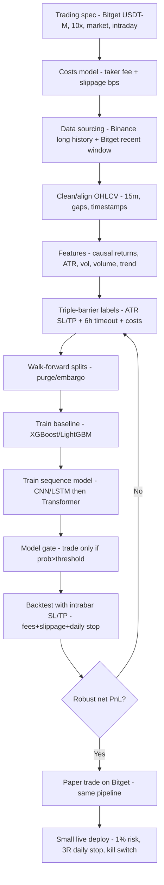

# Trading Bot Plan v1 (Research Prototype)

> **Scope:** v1 is a **research + paper-trading prototype** for **Bitget USDT-M futures** on **15-minute candles** using **market orders** and **model-gated entries** (long/short/no-trade).  
> **Goal:** a pipeline you can trust: data → features → labels → model → backtest (with costs) → paper trade.

⚠️ Not financial advice. With leverage, bad risk controls = fast liquidation.

---

## Locked decisions (v1)

- Exchange/market: **Bitget USDT-M perpetual futures**
- Leverage: **10x** (use **isolated margin**)
- Timeframe: **15m**
- Style: **intraday long/short**
- Max holding time: **6 hours (24 candles)**
- Orders: **market orders**
- Entry timing: decide at candle close, enter next candle open (avoid lookahead)
- Exit rules: **TP / SL only**, plus time-out at 6 hours
- One position at a time
- “Setup detected”: **model gate** (trade only above confidence/edge threshold)
- Position sizing: **fixed risk per trade** (recommended default: **1% equity risk**)
- Daily stop: **3R** (stop trading after 3 full-risk losses)

---

## End-to-end workflow

